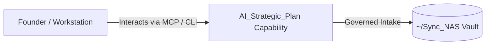

# AI_Strategic_Plan

> **Description**: AI Strategic Plan Factory
> **Version**: `0.0.1` | **Last Synced**: `2026-07-28 15:28:51 UTC` | **Git Commit**: `f960b5a0`

## Overview & Purpose

---

## Architecture & Ecosystem Connections

### Related Capabilities

- [[Search-Foundry]]
- [[Regenerative-Foundry]]
- [[Obsidian-Foundry]]
- [[Comms-Foundry]]
- [[Share]]

## Revision History

- **2026-07-28** (`f960b5a0`): Synchronized via Librarian Observer. *feat(llm-registry): implement federated autonomous LangChain facade and compliance nudges*

## Founder Notes & Manual Annotations

> *Add custom founder notes, architectural thoughts, or manual annotations here. This section is automatically preserved during periodic wiki delta syncs.*
