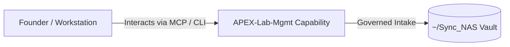

# APEX-Lab-Mgmt

> **Description**: Foundry Suite capability for APEX-Lab-Mgmt.
> **Version**: `0.1.0` | **Last Synced**: `2026-07-28 15:28:51 UTC` | **Git Commit**: `fd3e545e`

## Overview & Purpose

---

## CLI Entrypoints

- `obsidian-foundry list`
- `obsidian-foundry add`
- `obsidian-foundry daily`
- `obsidian-foundry weekly`

## Architecture & Ecosystem Connections

### Related Capabilities

- [[Search-Foundry]]
- [[Regenerative-Foundry]]
- [[Obsidian-Foundry]]
- [[Comms-Foundry]]
- [[Share]]

## Revision History

- **2026-07-28** (`fd3e545e`): Synchronized via Librarian Observer. *feat(llm-registry): implement federated autonomous LangChain facade and compliance nudges*

## Founder Notes & Manual Annotations

> *Add custom founder notes, architectural thoughts, or manual annotations here. This section is automatically preserved during periodic wiki delta syncs.*
