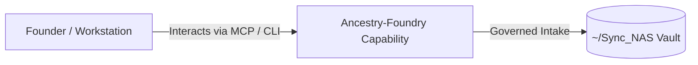

# Ancestry-Foundry

> **Description**: Foundry Suite capability for Ancestry-Foundry.
> **Version**: `0.1.0` | **Last Synced**: `2026-07-28 15:28:51 UTC` | **Git Commit**: `587e29cb`

## Overview & Purpose

---

## Key Codebase Modules

- `ancestry_foundry/__init__.py`
- `ancestry_foundry/canonical.py`
- `ancestry_foundry/config.py`
- `ancestry_foundry/date_parse.py`
- `ancestry_foundry/email_draft.py`
- `ancestry_foundry/exports.py`
- `ancestry_foundry/gedcom_io.py`
- `ancestry_foundry/geocoder.py`
- `ancestry_foundry/html_export.py`
- `ancestry_foundry/ics_export.py`

## Architecture & Ecosystem Connections

### Related Capabilities

- [[Search-Foundry]]
- [[Regenerative-Foundry]]
- [[Obsidian-Foundry]]
- [[Comms-Foundry]]
- [[Share]]

## Revision History

- **2026-07-28** (`587e29cb`): Synchronized via Librarian Observer. *chore: update README frontmatter and process nudges*

## Founder Notes & Manual Annotations

> *Add custom founder notes, architectural thoughts, or manual annotations here. This section is automatically preserved during periodic wiki delta syncs.*
