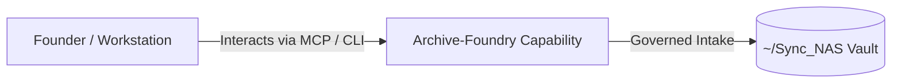

# Archive-Foundry

> **Description**: Foundry Suite capability for Archive-Foundry.
> **Version**: `0.1.0` | **Last Synced**: `2026-07-28 15:28:51 UTC` | **Git Commit**: `270ed789`

## Overview & Purpose

---

## Key Codebase Modules

- `app.py`
- `mcp_server.py`
- `storage/__init__.py`
- `storage/nas_cleanup_baseline.py`
- `storage/nas_sudo_check.py`
- `storage/provider.py`
- `storage/synology_provider.py`
- `sync_github_to_gitea.py`

## Architecture & Ecosystem Connections

### Related Capabilities

- [[Search-Foundry]]
- [[Regenerative-Foundry]]
- [[Obsidian-Foundry]]
- [[Comms-Foundry]]
- [[Share]]

## Revision History

- **2026-07-28** (`270ed789`): Synchronized via Librarian Observer. *chore: remove processed nudge files from inbox*

## Founder Notes & Manual Annotations

> *Add custom founder notes, architectural thoughts, or manual annotations here. This section is automatically preserved during periodic wiki delta syncs.*
