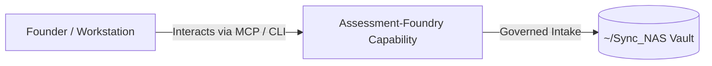

# Assessment-Foundry

> **Description**: Assessment Foundry
> **Version**: `0.1.0` | **Last Synced**: `2026-07-28 15:28:51 UTC` | **Git Commit**: `9b9de80b`

## Overview & Purpose

---

## Key Codebase Modules

- `assessment_foundry/env.py`
- `assessment_foundry/llm.py`
- `assessment_foundry/models/run.py`
- `assessment_foundry/orchestration.py`
- `assessment_foundry/prompts/manager.py`
- `assessment_foundry/stages/analyze.py`
- `assessment_foundry/stages/construct.py`
- `assessment_foundry/stages/explain.py`
- `assessment_foundry/stages/ingest.py`
- `assessment_foundry/stages/research.py`

## Architecture & Ecosystem Connections

### Related Capabilities

- [[Search-Foundry]]
- [[Regenerative-Foundry]]
- [[Obsidian-Foundry]]
- [[Comms-Foundry]]
- [[Share]]

## Revision History

- **2026-07-28** (`9b9de80b`): Synchronized via Librarian Observer. *Archive remaining manage nudges from inbox*

## Founder Notes & Manual Annotations

> *Add custom founder notes, architectural thoughts, or manual annotations here. This section is automatically preserved during periodic wiki delta syncs.*
