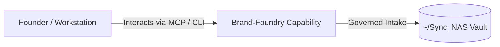

# Brand-Foundry

> **Description**: Foundry Suite capability for Brand-Foundry.
> **Version**: `0.1.0` | **Last Synced**: `2026-07-28 15:28:51 UTC` | **Git Commit**: `d25bae88`

## Overview & Purpose

---

## MCP Tool Surface

| Tool Name | Description |
| :--- | :--- |
| `brand_repo_status` | No docstring provided. |
| `brand_list_repos` | No docstring provided. |
| `brand_list_standards` | No docstring provided. |
| `brand_get_standard` | No docstring provided. |
| `brand_lint_markdown` | No docstring provided. |
| `brand_lint_markdown_text` | No docstring provided. |
| `brand_extract_posture` | No docstring provided. |
| `brand_ingest_suite_posture` | No docstring provided. |

## Architecture & Ecosystem Connections

### Related Capabilities

- [[Search-Foundry]]
- [[Regenerative-Foundry]]
- [[Obsidian-Foundry]]
- [[Comms-Foundry]]
- [[Share]]

## Revision History

- **2026-07-28** (`d25bae88`): Synchronized via Librarian Observer. *feat(branding): add automated communications standards for SMS and email*

## Founder Notes & Manual Annotations

> *Add custom founder notes, architectural thoughts, or manual annotations here. This section is automatically preserved during periodic wiki delta syncs.*
