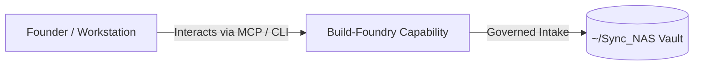

# Build-Foundry

> **Description**: Build Foundry — Ecosystem Scaffolding Engine & Midwife
> **Version**: `0.2.0` | **Last Synced**: `2026-07-28 15:28:51 UTC` | **Git Commit**: `32edc756`

## Overview & Purpose

---

## MCP Tool Surface

| Tool Name | Description |
| :--- | :--- |
| `register_work_order` | Register a work order from upstream foundry (e.g., Intent-Foundry). |
| `register_handoff_packet` | Register a handoff packet placed into the shared HANDOFF_DROPBOX_DIR. |
| `list_pending_work_orders` | List all registered but unprocessed work orders. |
| `get_work_order_details` | Get detailed information about a specific work order. |
| `verify_work_order_integrity` | Verify the integrity and completeness of a work order. |

## CLI Entrypoints

- `obsidian-foundry ingest`
- `obsidian-foundry decide_mode_cmd`
- `obsidian-foundry generate_packet_cmd`
- `obsidian-foundry export`
- `obsidian-foundry status`

## Key Codebase Modules

- `build_foundry/__init__.py`
- `build_foundry/__main__.py`
- `build_foundry/cli.py`
- `build_foundry/env.py`
- `build_foundry/graph/__init__.py`
- `build_foundry/graph/nodes/__init__.py`
- `build_foundry/graph/nodes/agentic_builder.py`
- `build_foundry/graph/nodes/agentic_executor.py`
- `build_foundry/graph/nodes/architect.py`
- `build_foundry/graph/nodes/auditor.py`

## Architecture & Ecosystem Connections

### Related Capabilities

- [[Search-Foundry]]
- [[Regenerative-Foundry]]
- [[Obsidian-Foundry]]
- [[Comms-Foundry]]
- [[Share]]

## Revision History

- **2026-07-28** (`32edc756`): Synchronized via Librarian Observer. *docs(dispatch): dispatch July 26 session wrap-up courtesy report to Manage-Foundry*

## Founder Notes & Manual Annotations

> *Add custom founder notes, architectural thoughts, or manual annotations here. This section is automatically preserved during periodic wiki delta syncs.*
