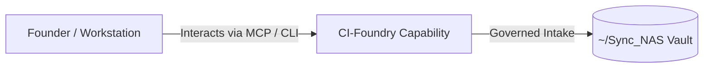

# CI-Foundry

> **Description**: Competitive Intelligence (CI) Foundry
> **Version**: `0.4.0` | **Last Synced**: `2026-07-28 15:28:51 UTC` | **Git Commit**: `733b518f`

## Overview & Purpose

---

## CLI Entrypoints

- `obsidian-foundry run`
- `obsidian-foundry bootstrap`

## Key Codebase Modules

- `ci_foundry/__init__.py`
- `ci_foundry/adapters.py`
- `ci_foundry/cli.py`
- `ci_foundry/llm.py`
- `ci_foundry/normalizers.py`
- `ci_foundry/run_naming.py`
- `ci_foundry/settings.py`
- `ci_foundry/storage.py`
- `ci_foundry/workflow.py`

## Architecture & Ecosystem Connections

### Related Capabilities

- [[Search-Foundry]]
- [[Regenerative-Foundry]]
- [[Obsidian-Foundry]]
- [[Comms-Foundry]]
- [[Share]]

## Revision History

- **2026-07-28** (`733b518f`): Synchronized via Librarian Observer. *feat(llm-registry): implement federated autonomous LangChain facade and compliance nudges*

## Founder Notes & Manual Annotations

> *Add custom founder notes, architectural thoughts, or manual annotations here. This section is automatically preserved during periodic wiki delta syncs.*
