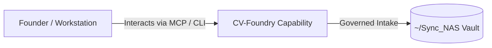

# CV-Foundry

> **Description**: Foundry Suite capability for CV-Foundry.
> **Version**: `0.1.0` | **Last Synced**: `2026-07-28 15:28:51 UTC` | **Git Commit**: `6bbf697c`

## Overview & Purpose

---

## MCP Tool Surface

| Tool Name | Description |
| :--- | :--- |
| `cv_validate` | No docstring provided. |
| `cv_list_profiles` | No docstring provided. |
| `cv_list_templates` | No docstring provided. |
| `cv_revision_history_tail` | No docstring provided. |
| `cv_sweep_get_state` | No docstring provided. |
| `cv_sweep_set_last_run` | No docstring provided. |
| `cv_sweep_update_notes` | No docstring provided. |
| `cv_inbox_add` | No docstring provided. |
| `cv_inbox_list` | No docstring provided. |
| `cv_inbox_update_status` | No docstring provided. |
| `cv_build` | No docstring provided. |
| `cv_export_files_to_static` | No docstring provided. |
| `cv_publish_us_federal_ai_leadership_html` | No docstring provided. |
| `cv_email_output` | No docstring provided. |

## Architecture & Ecosystem Connections

### Related Capabilities

- [[Search-Foundry]]
- [[Regenerative-Foundry]]
- [[Obsidian-Foundry]]
- [[Comms-Foundry]]
- [[Share]]

## Revision History

- **2026-07-28** (`6bbf697c`): Synchronized via Librarian Observer. *feat: Add SyntheticData-Foundry and ClusterAnalysis-Foundry capabilities to CV and US Federal AI Leadership profile*

## Founder Notes & Manual Annotations

> *Add custom founder notes, architectural thoughts, or manual annotations here. This section is automatically preserved during periodic wiki delta syncs.*
