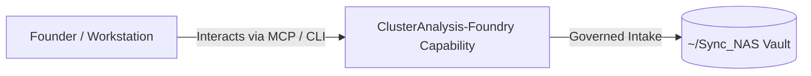

# ClusterAnalysis-Foundry

> **Description**: Unsupervised Multi-Method Clustering & Persona Abstraction Engine
> **Version**: `0.1.0` | **Last Synced**: `2026-07-28 15:28:51 UTC` | **Git Commit**: `0419b891`

## Overview & Purpose

---

## MCP Tool Surface

| Tool Name | Description |
| :--- | :--- |
| `cluster_status` | Check status and capabilities of ClusterAnalysis-Foundry MCP Server. |
| `cluster_run` | Execute cluster analysis pipeline on a CSV or JSON dataset. |
| `cluster_list_runs` | List historical isolated analysis runs stored in runs/ directory. |
| `cluster_get_run_summary` | Get detailed summary and manifest for a specific run ID. |

## Key Codebase Modules

- `app.py`
- `clustering_engine.py`
- `config.py`
- `intake_engine.py`
- `llm_labeler.py`
- `main.py`
- `mcp_server.py`
- `medoid_extractor.py`
- `persona_exporter.py`
- `reducer.py`

## Architecture & Ecosystem Connections

### Related Capabilities

- [[Search-Foundry]]
- [[Regenerative-Foundry]]
- [[Obsidian-Foundry]]
- [[Comms-Foundry]]
- [[Share]]

## Revision History

- **2026-07-28** (`0419b891`): Synchronized via Librarian Observer. *docs: add LOCAL_DATA_STORES_AND_MEMORY.md detailing memory management, local data store options, pros/cons, and intake code extensions*

## Founder Notes & Manual Annotations

> *Add custom founder notes, architectural thoughts, or manual annotations here. This section is automatically preserved during periodic wiki delta syncs.*
