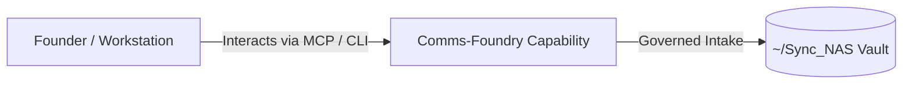

# Comms-Foundry

> **Description**: Forge once. Publish everywhere. Communications as code.
> **Version**: `0.1.0` | **Last Synced**: `2026-07-28 15:28:51 UTC` | **Git Commit**: `6e8b190c`

## Overview & Purpose

---

## MCP Tool Surface

| Tool Name | Description |
| :--- | :--- |
| `repo_status` | No docstring provided. |
| `list_posts` | No docstring provided. |
| `validate_post` | No docstring provided. |
| `plan_post` | No docstring provided. |
| `publish_static_html` | Publish a portable single-file HTML artifact into Share/content/static and optionally Quartz-sync. |
| `list_submissions` | List stored Markdown submissions in submissions/. |
| `load_submission` | Load a stored Markdown submission by filename from submissions/. |
| `submit_markdown` | Submit a Markdown-only envelope for Comms-Foundry intake. |
| `validate_submission_markdown` | Validate a Markdown submission envelope without saving it. |
| `plan_submission_markdown` | Plan publishing actions for a Markdown submission envelope without saving it. |
| `validate_submission` | Validate a stored submission in submissions/ by filename. |
| `plan_submission` | Plan publishing actions for a stored submission in submissions/ by filename. |
| `refine_submission` | Refine a stored submission's Markdown body using the centralized LLM client. |
| `ingest_work_order` | Ingest a work order from Imagination-Foundry and create a submission. |
| `list_work_orders` | List available work orders from Imagination-Foundry. |

## CLI Entrypoints

- `obsidian-foundry new`
- `obsidian-foundry validate`
- `obsidian-foundry plan`
- `obsidian-foundry suggest_banners`
- `obsidian-foundry publish`
- `obsidian-foundry export_html`
- `obsidian-foundry publish_static_html`
- `obsidian-foundry export_foundry_suite_brochure_cmd`
- `obsidian-foundry publish_foundry_suite_brochure`
- `obsidian-foundry recurrence_report`
- `obsidian-foundry recurrence_refresh`
- `obsidian-foundry recurrence_enable`
- `obsidian-foundry generate_suite_artifacts`

## Key Codebase Modules

- `comms_foundry/__init__.py`
- `comms_foundry/capability_harvester.py`
- `comms_foundry/cli.py`
- `comms_foundry/config.py`
- `comms_foundry/emailer.py`
- `comms_foundry/enhanced_brochure.py`
- `comms_foundry/external_html.py`
- `comms_foundry/foundry_suite_brochure.py`
- `comms_foundry/llm_client.py`
- `comms_foundry/mcp_server.py`

## Architecture & Ecosystem Connections

### Related Capabilities

- [[Search-Foundry]]
- [[Regenerative-Foundry]]
- [[Obsidian-Foundry]]
- [[Share]]

## Revision History

- **2026-07-28** (`6e8b190c`): Synchronized via Librarian Observer. *feat(comms): add email dispatch script and outbound executive report deliverables*

## Founder Notes & Manual Annotations

> *Add custom founder notes, architectural thoughts, or manual annotations here. This section is automatically preserved during periodic wiki delta syncs.*
