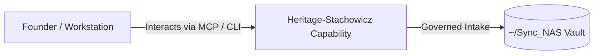

# Heritage-Stachowicz

> **Description**: Foundry Suite capability for Heritage-Stachowicz.
> **Version**: `0.1.0` | **Last Synced**: `2026-07-28 15:28:52 UTC` | **Git Commit**: `f53d8107`

## Overview & Purpose

---

## MCP Tool Surface

| Tool Name | Description |
| :--- | :--- |
| `run_governance_rules` | Run eldercare governance rules against a target directory. |

## Key Codebase Modules

- `coaching/empathetic_coach.py`
- `coaching/knowledge_guide.py`
- `db/sqlite_manager.py`
- `ingestion/pdf_parser.py`
- `tools/magic_fill.py`
- `tools/mcp_server.py`
- `tools/vector_journal.py`
- `ui/dashboard.py`

## Architecture & Ecosystem Connections

### Related Capabilities

- [[Search-Foundry]]
- [[Regenerative-Foundry]]
- [[Obsidian-Foundry]]
- [[Comms-Foundry]]
- [[Share]]

## Revision History

- **2026-07-28** (`f53d8107`): Synchronized via Librarian Observer. *feat: Sync upstream soft deletes and scheduling schema from Eldercare-Foundry*

## Founder Notes & Manual Annotations

> *Add custom founder notes, architectural thoughts, or manual annotations here. This section is automatically preserved during periodic wiki delta syncs.*
