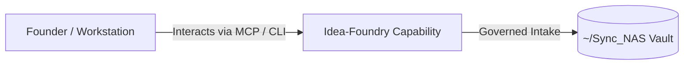

# Idea-Foundry

> **Description**: Foundry Suite capability for Idea-Foundry.
> **Version**: `0.1.0` | **Last Synced**: `2026-07-28 15:28:52 UTC` | **Git Commit**: `985de412`

## Overview & Purpose

---

## Key Codebase Modules

- `idea_foundry/graph/nodes/auditor.py`
- `idea_foundry/graph/nodes/drafting.py`
- `idea_foundry/graph/nodes/notify.py`
- `idea_foundry/graph/nodes/prep.py`
- `idea_foundry/graph/nodes/research.py`
- `idea_foundry/graph/nodes/synergy.py`
- `idea_foundry/graph/state.py`
- `idea_foundry/graph/workflow.py`

## Architecture & Ecosystem Connections

### Related Capabilities

- [[Search-Foundry]]
- [[Regenerative-Foundry]]
- [[Obsidian-Foundry]]
- [[Comms-Foundry]]
- [[Share]]

## Revision History

- **2026-07-28** (`985de412`): Synchronized via Librarian Observer. *feat(skills-foundry): complete Skills-Foundry intake, Part 1 LangGraph, and Part 3 handoff to Intent-Foundry*

## Founder Notes & Manual Annotations

> *Add custom founder notes, architectural thoughts, or manual annotations here. This section is automatically preserved during periodic wiki delta syncs.*
