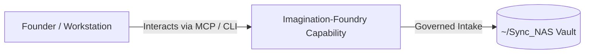

# Imagination-Foundry

> **Description**: Foundry Suite capability for Imagination-Foundry.
> **Version**: `0.1.0` | **Last Synced**: `2026-07-28 15:28:52 UTC` | **Git Commit**: `3ae01f50`

## Overview & Purpose

---

## MCP Tool Surface

| Tool Name | Description |
| :--- | :--- |
| `tool_describe` | Returns the server manifest and tool capabilities. |
| `imagination_dispatch_handoff` | Dispatch a work order to a downstream foundry. |

## Key Codebase Modules

- `imagination_foundry/__init__.py`
- `imagination_foundry/graph.py`
- `imagination_foundry/parser.py`
- `imagination_foundry/ui/__init__.py`
- `imagination_foundry/ui/app.py`
- `server.py`

## Architecture & Ecosystem Connections

### Related Capabilities

- [[Search-Foundry]]
- [[Regenerative-Foundry]]
- [[Obsidian-Foundry]]
- [[Comms-Foundry]]
- [[Share]]

## Revision History

- **2026-07-28** (`3ae01f50`): Synchronized via Librarian Observer. *chore: receive strategic orchestration vision in inbox*

## Founder Notes & Manual Annotations

> *Add custom founder notes, architectural thoughts, or manual annotations here. This section is automatically preserved during periodic wiki delta syncs.*
