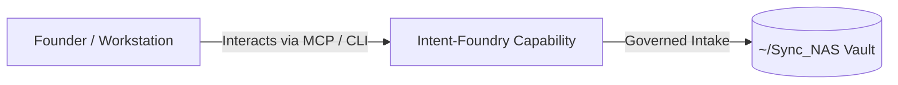

# Intent-Foundry

> **Description**: Foundry Suite capability for Intent-Foundry.
> **Version**: `0.1.0` | **Last Synced**: `2026-07-28 15:28:52 UTC` | **Git Commit**: `a50589d4`

## Overview & Purpose

---

## Key Codebase Modules

- `intent_foundry/__init__.py`
- `intent_foundry/graph/__init__.py`
- `intent_foundry/graph/nodes/__init__.py`
- `intent_foundry/graph/nodes/architect.py`
- `intent_foundry/graph/nodes/auditor.py`
- `intent_foundry/graph/nodes/ecosystem.py`
- `intent_foundry/graph/nodes/hitl.py`
- `intent_foundry/graph/nodes/intake.py`
- `intent_foundry/graph/nodes/judge.py`
- `intent_foundry/graph/nodes/retrospective.py`

## Architecture & Ecosystem Connections

### Related Capabilities

- [[Search-Foundry]]
- [[Regenerative-Foundry]]
- [[Obsidian-Foundry]]
- [[Comms-Foundry]]
- [[Share]]

## Revision History

- **2026-07-28** (`a50589d4`): Synchronized via Librarian Observer. *feat(foundry): Complete interactive HITL intent review and handoff registration for Cluster, Control-Plane, Watchdog, Event, and Skills Foundries*

## Founder Notes & Manual Annotations

> *Add custom founder notes, architectural thoughts, or manual annotations here. This section is automatically preserved during periodic wiki delta syncs.*
