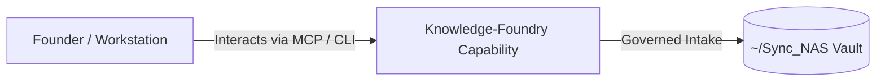

# Knowledge-Foundry

> **Description**: Knowledge-Foundry
> **Version**: `0.1.0` | **Last Synced**: `2026-07-28 15:28:52 UTC` | **Git Commit**: `b6dcf7ef`

## Overview & Purpose

---

## Key Codebase Modules

- `knowledge_foundry/__init__.py`
- `knowledge_foundry/config.py`
- `knowledge_foundry/paste_inbox.py`
- `knowledge_foundry/vault_manager.py`

## Architecture & Ecosystem Connections

### Related Capabilities

- [[Search-Foundry]]
- [[Regenerative-Foundry]]
- [[Obsidian-Foundry]]
- [[Comms-Foundry]]
- [[Share]]

## Revision History

- **2026-07-28** (`b6dcf7ef`): Synchronized via Librarian Observer. *feat(config): refactor path resolution for unified ~/Foundry-Suite/knowledge locations and add Rule 9 architecture diagrams*

## Founder Notes & Manual Annotations

> *Add custom founder notes, architectural thoughts, or manual annotations here. This section is automatically preserved during periodic wiki delta syncs.*
