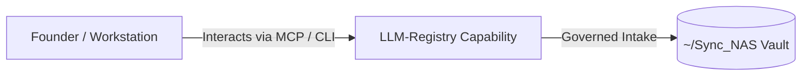

# LLM-Registry

> **Description**: Foundry Suite capability for LLM-Registry.
> **Version**: `0.1.0` | **Last Synced**: `2026-07-28 15:28:52 UTC` | **Git Commit**: `567aca6a`

## Overview & Purpose

---

## MCP Tool Surface

| Tool Name | Description |
| :--- | :--- |
| `get_best_model` | Recommend the best model for a given high-level task. |
| `generate_model_catalog_report` | Generates a professional Markdown table of all available models. |
| `log_usage` | Log LLM usage to the centralized registry database. |

## Key Codebase Modules

- `foundry_llm_analyzer.py`
- `llm_registry/__init__.py`
- `llm_registry/health.py`
- `llm_registry/registry.py`
- `llm_registry/reporter.py`
- `llm_registry/server.py`
- `llm_registry/templates/smart_langchain_facade.py`
- `llm_registry/templates/smart_llm_facade.py`
- `llm_registry/ui/app.py`
- `llm_registry/usage.py`

## Architecture & Ecosystem Connections

### Related Capabilities

- [[Search-Foundry]]
- [[Regenerative-Foundry]]
- [[Obsidian-Foundry]]
- [[Comms-Foundry]]
- [[Share]]

## Revision History

- **2026-07-28** (`567aca6a`): Synchronized via Librarian Observer. *feat: implement automated ecosystem-wide LLM usage telemetry proxy*

## Founder Notes & Manual Annotations

> *Add custom founder notes, architectural thoughts, or manual annotations here. This section is automatically preserved during periodic wiki delta syncs.*
