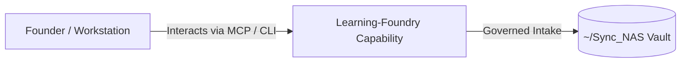

# Learning-Foundry

> **Description**: Foundry Suite capability for Learning-Foundry.
> **Version**: `0.1.0` | **Last Synced**: `2026-07-28 15:28:52 UTC` | **Git Commit**: `f6e1bc74`

## Overview & Purpose

---

## Key Codebase Modules

- `learning_foundry/__init__.py`
- `learning_foundry/backlog_ops.py`
- `learning_foundry/coach/activity_sensor.py`
- `learning_foundry/coach/briefing_generator.py`
- `learning_foundry/coach/generate_and_dispatch_briefing.py`
- `learning_foundry/coach/memory_recall.py`
- `learning_foundry/learning_catalog.py`
- `learning_foundry/run_catalog.py`
- `learning_foundry/ui/__init__.py`
- `learning_foundry/ui/app.py`

## Architecture & Ecosystem Connections

### Related Capabilities

- [[Search-Foundry]]
- [[Regenerative-Foundry]]
- [[Obsidian-Foundry]]
- [[Comms-Foundry]]
- [[Share]]

## Revision History

- **2026-07-28** (`f6e1bc74`): Synchronized via Librarian Observer. *docs(curriculum): add Skills-Foundry pipeline submission notice and Antigravity skills voice harvesting curriculum*

## Founder Notes & Manual Annotations

> *Add custom founder notes, architectural thoughts, or manual annotations here. This section is automatically preserved during periodic wiki delta syncs.*
