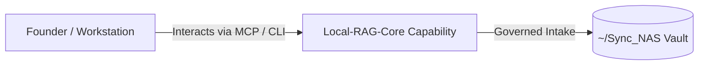

# Local-RAG-Core

> **Description**: Core engine for Local RAG
> **Version**: `0.1.0` | **Last Synced**: `2026-07-28 15:28:52 UTC` | **Git Commit**: `643ec35f`

## Overview & Purpose

---

## Key Codebase Modules

- `localrag/__init__.py`
- `localrag/chat/__init__.py`
- `localrag/chat/provider.py`
- `localrag/config.py`
- `localrag/embeddings/__init__.py`
- `localrag/embeddings/provider.py`
- `localrag/ingestion/__init__.py`
- `localrag/ingestion/chunking.py`
- `localrag/ingestion/loaders.py`
- `localrag/kb/__init__.py`

## Architecture & Ecosystem Connections

### Related Capabilities

- [[Search-Foundry]]
- [[Regenerative-Foundry]]
- [[Obsidian-Foundry]]
- [[Comms-Foundry]]
- [[Share]]

## Revision History

- **2026-07-28** (`643ec35f`): Synchronized via Librarian Observer. *feat(llm-registry): implement federated autonomous LangChain facade and compliance nudges*

## Founder Notes & Manual Annotations

> *Add custom founder notes, architectural thoughts, or manual annotations here. This section is automatically preserved during periodic wiki delta syncs.*
