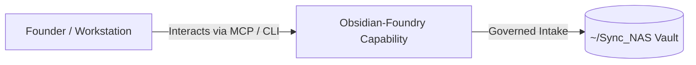

# Obsidian-Foundry

> **Description**: Obsidian-Foundry: vault ops and governance MCP server
> **Version**: `0.1.0` | **Last Synced**: `2026-07-28 15:28:52 UTC` | **Git Commit**: `158bc890`

## Overview & Purpose

---

## MCP Tool Surface

| Tool Name | Description |
| :--- | :--- |
| `audit_vault` | Deterministically audit an Obsidian vault for basic hygiene. |
| `plan_fixes` | Generate a plan (no side effects) for fixes based on current audit. |
| `intake_note` | Create a new note under the vault using a governed contract. |
| `baseline_metrics` | No docstring provided. |
| `write_baseline_snapshot` | No docstring provided. |
| `audit_wiki_state` | Audit the drift between local Foundry repositories and the vault wiki tree. |
| `plan_wiki_sync` | Produces a no-side-effects plan of wiki pages that will be created or updated. |
| `sync_wiki` | Runs the Librarian state machine pipeline to update ~/Sync_NAS/Foundry-Suite/Wiki/. |

## CLI Entrypoints

- `obsidian-foundry hello`
- `obsidian-foundry audit_vault_cmd`

## Key Codebase Modules

- `obsidian_foundry/__init__.py`
- `obsidian_foundry/cli.py`
- `obsidian_foundry/librarian/__init__.py`
- `obsidian_foundry/librarian/collector.py`
- `obsidian_foundry/librarian/delta_tracker.py`
- `obsidian_foundry/librarian/graph.py`
- `obsidian_foundry/mcp_server.py`

## Architecture & Ecosystem Connections

### Related Capabilities

- [[Search-Foundry]]
- [[Regenerative-Foundry]]
- [[Comms-Foundry]]
- [[Share]]

## Revision History

- **2026-07-28** (`158bc890`): Synchronized via Librarian Observer. *feat(llm-registry): implement federated autonomous LangChain facade and compliance nudges*

## Founder Notes & Manual Annotations

> *Add custom founder notes, architectural thoughts, or manual annotations here. This section is automatically preserved during periodic wiki delta syncs.*
