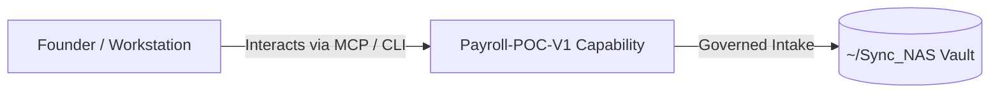

# Payroll-POC-V1

> **Description**: Payroll Error Log Analyzer (Streamlit) with optional RAG via localrag API
> **Version**: `0.1.0` | **Last Synced**: `2026-07-28 15:28:52 UTC` | **Git Commit**: `9df03b8a`

## Overview & Purpose

---

## Key Codebase Modules

- `payroll_poc_v1/__init__.py`
- `payroll_poc_v1/localrag_client.py`

## Architecture & Ecosystem Connections

### Related Capabilities

- [[Search-Foundry]]
- [[Regenerative-Foundry]]
- [[Obsidian-Foundry]]
- [[Comms-Foundry]]
- [[Share]]

## Revision History

- **2026-07-28** (`9df03b8a`): Synchronized via Librarian Observer. *feat(llm-registry): implement federated autonomous LangChain facade and compliance nudges*

## Founder Notes & Manual Annotations

> *Add custom founder notes, architectural thoughts, or manual annotations here. This section is automatically preserved during periodic wiki delta syncs.*
