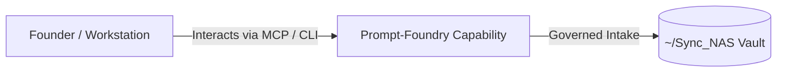

# Prompt-Foundry

> **Description**: Prompt creation, validation, and announcement HTML assembly with profile-based defaults.
> **Version**: `0.2.0` | **Last Synced**: `2026-07-28 15:28:53 UTC` | **Git Commit**: `0d70a92b`

## Overview & Purpose

---

## MCP Tool Surface

| Tool Name | Description |
| :--- | :--- |
| `list_prompts` | List prompt markdown files. |
| `validate_prompt` | Validate a single markdown prompt. |
| `normalize_prompt` | Normalize a single markdown prompt in place (optional). |
| `assemble_prompt` | Assemble a single prompt into an HTML announcement. |
| `assemble_all` | Assemble all prompts in a directory into HTML announcements. |
| `process_raw_prompt` | Intake a raw prompt, validate, standardize, persist as Markdown,  |

## CLI Entrypoints

- `obsidian-foundry assemble`
- `obsidian-foundry assemble_all`
- `obsidian-foundry validate`
- `obsidian-foundry validate_all`
- `obsidian-foundry normalize`
- `obsidian-foundry normalize_all`
- `obsidian-foundry simulate`
- `obsidian-foundry ingest`
- `obsidian-foundry catalog`

## Key Codebase Modules

- `prompt_foundry/__init__.py`
- `prompt_foundry/assemble.py`
- `prompt_foundry/chat.py`
- `prompt_foundry/cli.py`
- `prompt_foundry/env.py`
- `prompt_foundry/header.py`
- `prompt_foundry/mcp_server.py`
- `prompt_foundry/normalize.py`
- `prompt_foundry/ollama.py`
- `prompt_foundry/profile.py`

## Architecture & Ecosystem Connections

### Related Capabilities

- [[Search-Foundry]]
- [[Regenerative-Foundry]]
- [[Obsidian-Foundry]]
- [[Comms-Foundry]]
- [[Share]]

## Revision History

- **2026-07-28** (`0d70a92b`): Synchronized via Librarian Observer. *feat(llm-registry): implement federated autonomous LangChain facade and compliance nudges*

## Founder Notes & Manual Annotations

> *Add custom founder notes, architectural thoughts, or manual annotations here. This section is automatically preserved during periodic wiki delta syncs.*
