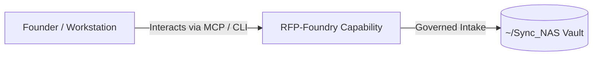

# RFP-Foundry

> **Description**: Foundry Suite capability for RFP-Foundry.
> **Version**: `0.1.0` | **Last Synced**: `2026-07-28 15:28:53 UTC` | **Git Commit**: `b866d59f`

## Overview & Purpose

---

## Architecture & Ecosystem Connections

### Related Capabilities

- [[Search-Foundry]]
- [[Regenerative-Foundry]]
- [[Obsidian-Foundry]]
- [[Comms-Foundry]]
- [[Share]]

## Revision History

- **2026-07-28** (`b866d59f`): Synchronized via Librarian Observer. *feat(spawn): auto-register spawned instances in ~/.foundry-suite/local_repos.jsonl*

## Founder Notes & Manual Annotations

> *Add custom founder notes, architectural thoughts, or manual annotations here. This section is automatically preserved during periodic wiki delta syncs.*
