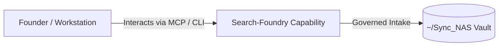

# Search-Foundry

> **Description**: Foundry Suite capability for Search-Foundry.
> **Version**: `0.1.0` | **Last Synced**: `2026-07-28 15:28:53 UTC` | **Git Commit**: `5cb4225c`

## Overview & Purpose

---

## Key Codebase Modules

- `__init__.py`
- `crawler.py`
- `repo_registry.py`
- `ui.py`
- `vector_engine.py`

## Architecture & Ecosystem Connections

### Related Capabilities

- [[Regenerative-Foundry]]
- [[Obsidian-Foundry]]
- [[Comms-Foundry]]
- [[Share]]

## Revision History

- **2026-07-28** (`5cb4225c`): Synchronized via Librarian Observer. *feat(ui): add context-sensitive help for semantic search limitations*

## Founder Notes & Manual Annotations

> *Add custom founder notes, architectural thoughts, or manual annotations here. This section is automatically preserved during periodic wiki delta syncs.*
