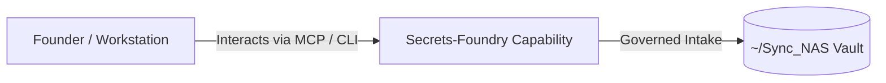

# Secrets-Foundry

> **Description**: Dynamic secrets management for the Foundry Ecosystem
> **Version**: `0.1.0` | **Last Synced**: `2026-07-28 15:28:53 UTC` | **Git Commit**: `941f6c69`

## Overview & Purpose

---

## CLI Entrypoints

- `obsidian-foundry get_secret`
- `obsidian-foundry check_auth`

## Key Codebase Modules

- `secrets_foundry/__init__.py`
- `secrets_foundry/cli.py`

## Architecture & Ecosystem Connections

### Related Capabilities

- [[Search-Foundry]]
- [[Regenerative-Foundry]]
- [[Obsidian-Foundry]]
- [[Comms-Foundry]]
- [[Share]]

## Revision History

- **2026-07-28** (`941f6c69`): Synchronized via Librarian Observer. *feat: add 1password tagging script with nested taxonomy*

## Founder Notes & Manual Annotations

> *Add custom founder notes, architectural thoughts, or manual annotations here. This section is automatically preserved during periodic wiki delta syncs.*
