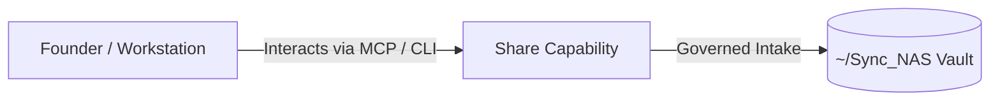

# Share

> **Description**: 🌱 publish your digital garden and notes as a website
> **Version**: `4.5.2` | **Last Synced**: `2026-07-28 15:28:53 UTC` | **Git Commit**: `509146ee`

## Overview & Purpose

---

## Architecture & Ecosystem Connections

### Related Capabilities

- [[Search-Foundry]]
- [[Regenerative-Foundry]]
- [[Obsidian-Foundry]]
- [[Comms-Foundry]]

## Revision History

- **2026-07-28** (`509146ee`): Synchronized via Librarian Observer. *Quartz sync: 2026-07-27 18:00*

## Founder Notes & Manual Annotations

> *Add custom founder notes, architectural thoughts, or manual annotations here. This section is automatically preserved during periodic wiki delta syncs.*
