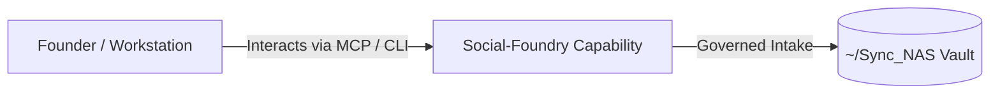

# Social-Foundry

> **Description**: Foundry Suite capability for Social-Foundry.
> **Version**: `0.1.0` | **Last Synced**: `2026-07-28 15:28:53 UTC` | **Git Commit**: `39b336c9`

## Overview & Purpose

---

## Key Codebase Modules

- `harvester.py`
- `main.py`
- `persona_generator.py`
- `utils/__init__.py`
- `utils/smart_langchain_facade.py`

## Architecture & Ecosystem Connections

### Related Capabilities

- [[Search-Foundry]]
- [[Regenerative-Foundry]]
- [[Obsidian-Foundry]]
- [[Comms-Foundry]]
- [[Share]]

## Revision History

- **2026-07-28** (`39b336c9`): Synchronized via Librarian Observer. *docs: update metadata front matter in README.md*

## Founder Notes & Manual Annotations

> *Add custom founder notes, architectural thoughts, or manual annotations here. This section is automatically preserved during periodic wiki delta syncs.*
