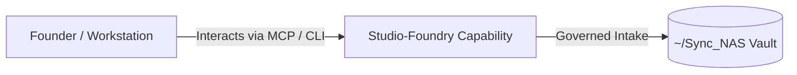

# Studio-Foundry

> **Description**: Foundry Suite capability for Studio-Foundry.
> **Version**: `0.1.0` | **Last Synced**: `2026-07-28 15:28:53 UTC` | **Git Commit**: `ed4f9558`

## Overview & Purpose

---

## Key Codebase Modules

- `studio_foundry/ffmpeg/processing.py`
- `studio_foundry/ffmpeg/server.py`
- `studio_foundry/graph/nodes/nodes.py`
- `studio_foundry/graph/state.py`
- `studio_foundry/graph/workflow.py`
- `studio_foundry/obs/client.py`
- `studio_foundry/obs/server.py`
- `studio_foundry/orchestration/pipeline.py`
- `studio_foundry/promotion/teaser_gen.py`
- `studio_foundry/syndication/publisher.py`

## Architecture & Ecosystem Connections

### Related Capabilities

- [[Search-Foundry]]
- [[Regenerative-Foundry]]
- [[Obsidian-Foundry]]
- [[Comms-Foundry]]
- [[Share]]

## Revision History

- **2026-07-28** (`ed4f9558`): Synchronized via Librarian Observer. *feat: Add compliance reports, ui metadata, primer documentation, and requirements*

## Founder Notes & Manual Annotations

> *Add custom founder notes, architectural thoughts, or manual annotations here. This section is automatically preserved during periodic wiki delta syncs.*
