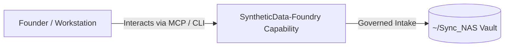

# SyntheticData-Foundry

> **Description**: SyntheticData-Foundry — Schema-driven, privacy-preserving dataset & vector synthesis engine
> **Version**: `0.1.0` | **Last Synced**: `2026-07-28 15:28:53 UTC` | **Git Commit**: `56b4a920`

## Overview & Purpose

---

## Key Codebase Modules

- `app.py`
- `embedding_cipher.py`
- `export_connectors.py`
- `intake_adapters.py`
- `main.py`
- `model_router.py`
- `production_profile.py`
- `relational_engine.py`
- `run_manager.py`
- `schema_ir.py`

## Architecture & Ecosystem Connections

### Related Capabilities

- [[Search-Foundry]]
- [[Regenerative-Foundry]]
- [[Obsidian-Foundry]]
- [[Comms-Foundry]]
- [[Share]]

## Revision History

- **2026-07-28** (`56b4a920`): Synchronized via Librarian Observer. *feat(syntheticdata): update capability documentation and schema engine*

## Founder Notes & Manual Annotations

> *Add custom founder notes, architectural thoughts, or manual annotations here. This section is automatically preserved during periodic wiki delta syncs.*
