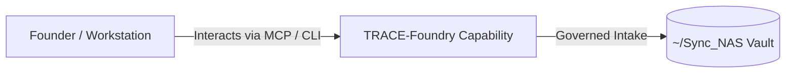

# TRACE-Foundry

> **Description**: Local-first TRACE Foundry MCP Research Foundry
> **Version**: `0.2.0` | **Last Synced**: `2026-07-28 15:28:54 UTC` | **Git Commit**: `f57f42ea`

## Overview & Purpose

---

## MCP Tool Surface

| Tool Name | Description |
| :--- | :--- |
| `trace_create_run` | No docstring provided. |
| `trace_fork_run_from_sources` | No docstring provided. |
| `trace_export_run_package_html` | No docstring provided. |
| `trace_migrate_run_dirs` | No docstring provided. |
| `trace_migrate_all_runs` | No docstring provided. |
| `trace_list_runs` | No docstring provided. |
| `trace_run_stage` | No docstring provided. |
| `trace_create_hitl_review` | No docstring provided. |
| `trace_list_hitl_reviews` | No docstring provided. |
| `trace_build_package` | No docstring provided. |
| `trace_describe_run` | No docstring provided. |
| `trace_list_artifacts` | No docstring provided. |
| `trace_render_output` | No docstring provided. |
| `trace_export_artifact_to_obsidian` | No docstring provided. |
| `trace_list_ollama_models` | No docstring provided. |
| `trace_prompts_list` | No docstring provided. |
| `trace_prompts_show` | No docstring provided. |
| `trace_compare_runs_delta` | No docstring provided. |
| `trace_email_run_package` | No docstring provided. |
| `trace_run_full_pipeline` | No docstring provided. |
| `trace_intake_work_order_yaml` | No docstring provided. |
| `trace_create_run` | No docstring provided. |
| `trace_fork_run_from_sources` | No docstring provided. |
| `trace_export_run_package_html` | No docstring provided. |
| `trace_migrate_run_dirs` | No docstring provided. |
| `trace_migrate_all_runs` | No docstring provided. |
| `trace_list_runs` | No docstring provided. |
| `trace_run_stage` | No docstring provided. |
| `trace_create_hitl_review` | No docstring provided. |
| `trace_list_hitl_reviews` | No docstring provided. |
| `trace_build_package` | No docstring provided. |
| `trace_describe_run` | No docstring provided. |
| `trace_list_artifacts` | No docstring provided. |
| `trace_render_output` | No docstring provided. |
| `trace_export_artifact_to_obsidian` | No docstring provided. |
| `trace_list_ollama_models` | No docstring provided. |
| `trace_prompts_list` | No docstring provided. |
| `trace_prompts_show` | No docstring provided. |
| `trace_compare_runs_delta` | No docstring provided. |
| `trace_email_run_package` | No docstring provided. |
| `trace_run_full_pipeline` | No docstring provided. |
| `trace_intake_work_order_yaml` | No docstring provided. |

## Architecture & Ecosystem Connections

### Related Capabilities

- [[Search-Foundry]]
- [[Regenerative-Foundry]]
- [[Obsidian-Foundry]]
- [[Comms-Foundry]]
- [[Share]]

## Revision History

- **2026-07-28** (`f57f42ea`): Synchronized via Librarian Observer. *feat(llm-registry): implement federated autonomous LangChain facade and compliance nudges*

## Founder Notes & Manual Annotations

> *Add custom founder notes, architectural thoughts, or manual annotations here. This section is automatically preserved during periodic wiki delta syncs.*
