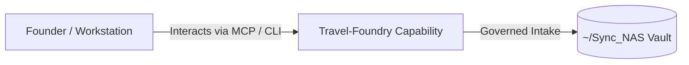

# Travel-Foundry

> **Description**: Foundry Suite capability for Travel-Foundry.
> **Version**: `0.1.0` | **Last Synced**: `2026-07-28 15:28:54 UTC` | **Git Commit**: `f8623c91`

## Overview & Purpose

---

## Key Codebase Modules

- `api/main.py`
- `ui/app.py`

## Architecture & Ecosystem Connections

### Related Capabilities

- [[Search-Foundry]]
- [[Regenerative-Foundry]]
- [[Obsidian-Foundry]]
- [[Comms-Foundry]]
- [[Share]]

## Revision History

- **2026-07-28** (`f8623c91`): Synchronized via Librarian Observer. *chore: scaffold Travel-Foundry and log Boston Sail250 trip*

## Founder Notes & Manual Annotations

> *Add custom founder notes, architectural thoughts, or manual annotations here. This section is automatically preserved during periodic wiki delta syncs.*
