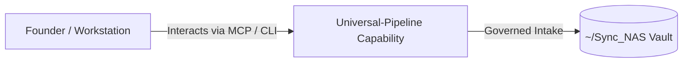

# Universal-Pipeline

> **Description**: Foundry Suite capability for Universal-Pipeline.
> **Version**: `0.1.0` | **Last Synced**: `2026-07-28 15:28:54 UTC` | **Git Commit**: `7ec275c0`

## Overview & Purpose

---

## MCP Tool Surface

| Tool Name | Description |
| :--- | :--- |
| `get_pending_reviews` | Get a list of URLs waiting for human review. |
| `approve_source` | Approve a URL to be ingested by the pipeline. |
| `reject_source` | Reject a URL from being ingested. |

## Key Codebase Modules

- `database/connector.py`
- `database/schema.py`
- `hitl/mcp_server.py`
- `ingestion/manager.py`
- `nodes/auditor.py`
- `nodes/critique.py`
- `nodes/extract.py`
- `nodes/fetch.py`
- `nodes/persistence.py`
- `nodes/semantic_continuity.py`

## Architecture & Ecosystem Connections

### Related Capabilities

- [[Search-Foundry]]
- [[Regenerative-Foundry]]
- [[Obsidian-Foundry]]
- [[Comms-Foundry]]
- [[Share]]

## Revision History

- **2026-07-28** (`7ec275c0`): Synchronized via Librarian Observer. *feat: Port UI and capability enhancements from AI-Governance-Pipeline*

## Founder Notes & Manual Annotations

> *Add custom founder notes, architectural thoughts, or manual annotations here. This section is automatically preserved during periodic wiki delta syncs.*
