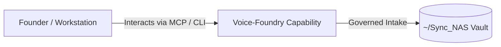

# Voice-Foundry

> **Description**: A bare-metal dictation daemon, central PostgreSQL vector store, and AI interaction intelligence platform
> **Version**: `0.2.0` | **Last Synced**: `2026-07-28 15:28:54 UTC` | **Git Commit**: `de2f1cd7`

## Overview & Purpose

---

## Key Codebase Modules

- `daemon/db.py`
- `daemon/server.py`
- `daemon/sync_worker.py`
- `daemon/tts_providers.py`
- `daemon/ui/app.py`

## Architecture & Ecosystem Connections

### Related Capabilities

- [[Search-Foundry]]
- [[Regenerative-Foundry]]
- [[Obsidian-Foundry]]
- [[Comms-Foundry]]
- [[Share]]

## Revision History

- **2026-07-28** (`de2f1cd7`): Synchronized via Librarian Observer. *chore(logs): update dictation history with latest voice dictation entries*

## Founder Notes & Manual Annotations

> *Add custom founder notes, architectural thoughts, or manual annotations here. This section is automatically preserved during periodic wiki delta syncs.*
