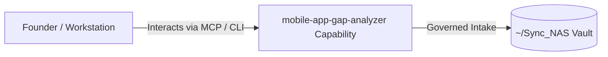

# mobile-app-gap-analyzer

> **Description**: Mobile App Market Gap Analyzer
> **Version**: `0.1.0` | **Last Synced**: `2026-07-28 15:28:52 UTC` | **Git Commit**: `c80521d5`

## Overview & Purpose

---

## CLI Entrypoints

- `obsidian-foundry analyze`
- `obsidian-foundry init_spec`
- `obsidian-foundry run_spec`
- `obsidian-foundry rerun`
- `obsidian-foundry build_spec`

## Key Codebase Modules

- `maga/__init__.py`
- `maga/build_spec.py`
- `maga/cli.py`
- `maga/config.py`
- `maga/db.py`
- `maga/graph.py`
- `maga/itunes.py`
- `maga/llm.py`
- `maga/models.py`
- `maga/reporting.py`

## Architecture & Ecosystem Connections

### Related Capabilities

- [[Search-Foundry]]
- [[Regenerative-Foundry]]
- [[Obsidian-Foundry]]
- [[Comms-Foundry]]
- [[Share]]

## Revision History

- **2026-07-28** (`c80521d5`): Synchronized via Librarian Observer. *feat: implement automated ecosystem-wide LLM usage telemetry proxy*

## Founder Notes & Manual Annotations

> *Add custom founder notes, architectural thoughts, or manual annotations here. This section is automatically preserved during periodic wiki delta syncs.*
