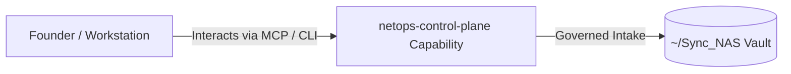

# netops-control-plane

> **Description**: Local MCP console + port governance
> **Version**: `0.1.0` | **Last Synced**: `2026-07-28 15:28:52 UTC` | **Git Commit**: `79d66c63`

## Overview & Purpose

---

## MCP Tool Surface

| Tool Name | Description |
| :--- | :--- |
| `netops_validate_config` | Validate a NetOps YAML config. |
| `netops_port_report` | Generate a port governance report. |
| `netops_reserve_ports` | Reserve one or more ports in the NetOps registry. |
| `netops_resolve_port` | Resolve (and optionally persist) a stable port assignment for a service. |

## Architecture & Ecosystem Connections

### Related Capabilities

- [[Search-Foundry]]
- [[Regenerative-Foundry]]
- [[Obsidian-Foundry]]
- [[Comms-Foundry]]
- [[Share]]

## Revision History

- **2026-07-28** (`79d66c63`): Synchronized via Librarian Observer. *feat(netops): register RFP-Foundry (8700) and RFP-2026-DEMO (8701) UI ports*

## Founder Notes & Manual Annotations

> *Add custom founder notes, architectural thoughts, or manual annotations here. This section is automatically preserved during periodic wiki delta syncs.*
