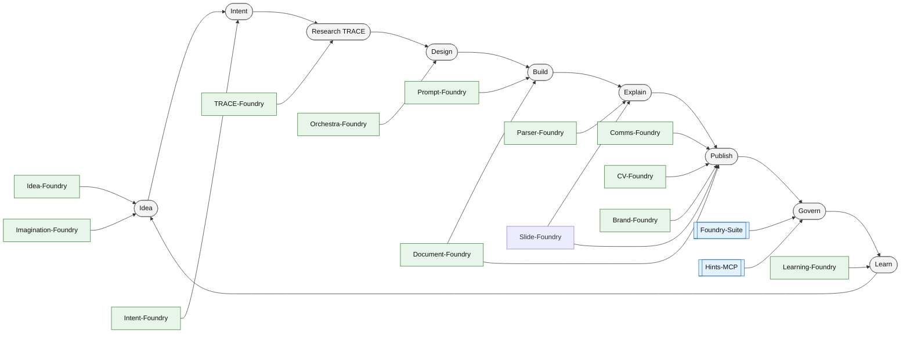

# What is Foundry-Suite

Status: Active / Evolving

Version: 0.3.8

Last updated: 2026-06-29

Change log:

- 0.3.8: Added Secrets-Foundry, Encrypt-Foundry, Archive-Foundry, and Manage-Foundry to the ecosystem canon, formalizing zero-trust hardware encryption, NAS storage governance, 1Password secrets management, and a unified Command Center.
- 0.3.7: Added Export-Foundry, Archimate-Foundry, Governance-Foundry, and Reference-Foundry to the ecosystem canon.
- 0.3.6: Elevated Document-Foundry and Parser-Foundry roles in the suite narrative and updated lifecycle alignment to reflect their utility across Foundries.
- 0.3.5: Documented the Foundry-Suite Overview Streamlit UI and its Canon Browser as a convenient way to browse this repo's canon in a web view.
- 0.3.4: Added Hints-Foundry as a knowledge management and pattern library component.
- 0.3.3: Introduced graph-native orchestration posture, added Orchestra-Foundry as a planned orchestrator, and completed the TRACE-Loop-Lite rebrand to TRACE-Foundry in suite-level canon.
- 0.3.2: Added Imagination-Foundry narrative integration and clarified its role as upstream intake and routing.
- 0.3.1: Consolidated visual overview into a single canonical map under canon/architecture.
- 0.3.0: Added visual overview diagrams and a lessons learned section.
- 0.2.0: Added suite-owned capabilities (LLM Registry MCP, Foundry Monitor) and introduced document versioning.
- 0.1.0: Initial canon publication.

## Executive overview

Foundry-Suite is a federated, local-first ecosystem of small, specialized repositories that help a human founder collaborate with AI in an artifact-driven way.

It is designed around a simple goal:

- reduce cognitive load for planning, communication, curation, and execution
- increase creative bandwidth for exploration and “what could be” thinking
- preserve trust through human-in-the-loop operation and provenance-first workflows

The core design choice is that AI is treated as a **co-collaborator beside you at the workbench**, not merely a tool on the workbench.

## Visual overview

These diagrams are intentionally lightweight and should stay stable even as the ecosystem evolves.

Streamlit view (for convenient browsing):

- `bash ./ui_start.sh`
- Navigate to `Canon Browser` to browse `canon/` (architecture, charter, constitution) plus key root-level docs.

Canonical map:

- `canon/architecture/foundry_suite_map.md`

### Architecture cartography (generated)

The suite also maintains a versioned, auto-generated architecture package under `canon/architecture/`.

- `canon/architecture/architecture_narrative.md`
- `canon/architecture/legend.md`
- `canon/architecture/layout_grid.json`
- `canon/architecture/excalidraw_model.json`

### Knowledge worker lifecycle and Foundry alignment

## What we built in the last two weeks

Over roughly two weeks of rapid iteration, the suite matured from a set of experiments into a coherent framework:

- a shared governance anchor (this repository)
- a consistent lifecycle spine (Learning → Idea → Intent → Build → Publish)
- a federated model of cooperating repos (Foundries) and temporary experiments (Labs)
- a practical “contracts over assumptions” approach using MCP tools and structured artifacts
- operational support for discovery, launching, and monitoring of local services
- a suite-owned LLM Registry (MCP) to support cost-effective, task-appropriate model selection
- a suite-owned Foundry Monitor workbench for compliance visibility and operational awareness

The result is not one product or one app.

It is a **methodology and working system** for building and operating an AI-augmented knowledge-work practice.

## The key idea: a craft workshop for knowledge work

Think of each Foundry as a workshop that:

- accepts inputs in a predictable form
- produces outputs as named, reviewable artifacts
- can be invoked via explicit tools or repeatable commands
- remains understandable to humans without requiring hidden context

The suite is intentionally modular and loosely coupled.

- each repo owns its own internal implementation
- cross-repo interactions happen through artifacts and MCP contracts
- everything is meant to be inspectable and explainable

## What “governance” means here

Foundry-Suite is the governance and canonical anchor. It hosts:

- constitution-level principles and shared mental models
- charters that define expectations for suite citizenship
- templates/prompts that help new repos become suite-aware quickly
- registries that support ecosystem discovery

Detailed implementation patterns (the “how”) live in the centralized Hints-MCP catalog.

## The operating philosophy

### 1) Artifact-first over chat-first

Chat is valuable for exploration, but durable work requires durable artifacts.

The suite pushes work into traceable outputs:

- submissions
- specs
- logs
- reports
- published deliverables

This makes the work:

- reviewable
- auditable
- repeatable
- easy to hand off between repos and agents

### 2) Human-in-the-loop by default

The suite treats autonomy as a spectrum.

A typical pattern is:

- AI proposes
- human approves
- AI executes within clear boundaries
- artifacts are produced with provenance

This reduces anxiety and distrust by making the system legible.

### 3) Provenance and transparency are non-negotiable

The suite prefers:

- explicit inputs and outputs
- named artifacts
- run logs and summaries
- clear records of what changed and why

When something is uncertain, the system should say so.

### 4) Federation over centralization

The suite is deliberately not a monolith.

Federation enables:

- local autonomy
- parallel evolution of components
- resilience when one component is offline
- safe experimentation without destabilizing the whole

### 5) “AI beside you” as a design target

The suite is built to support the lived experience of collaboration:

- you can ask for help drafting, planning, structuring, reviewing, and executing
- the AI can look at the same artifacts you see
- the AI can operate within repeatable pipelines rather than ad-hoc magic

This is a practical path toward a knowledge-worker setting where human and AI operate side-by-side.

### 6) Graph-native orchestration where it reduces friction

Many Foundry workflows are naturally expressed as a graph rather than a strict linear script.

When it improves reliability and iteration speed, Foundries may implement orchestration as a stateful graph (e.g., using LangGraph) to support:

- loops and retries
- conditional routing between stages
- explicit human-in-the-loop gates
- controlled cross-Foundry handoffs

## The lifecycle spine

The suite uses a consistent maturity model to orient work:

- Learning: acquire capability and context
- Idea: frame opportunities and proposals
- Intent: commit scope and produce execution-ready specifications
- Build: construct assets and systems
- Publish: package outputs for reuse, portfolio, or distribution

Not all work is linear, but all work fits somewhere on this spine.

## Component map: current state and aspirational direction

This section is intentionally written to be maintainable. It should be updated as capabilities mature.

### Governance anchor

#### Foundry-Suite

Current:

- defines shared principles and expectations
- provides templates/prompts for suite awareness
- hosts canonical registries for repo and service discovery

Aspirational:

- clearer cross-repo contracts under `contracts/`
- an ecosystem registry MCP server to make discovery/querying a first-class operation

### Core pipeline Foundries

#### Learning-Foundry

Current:

- structured learning backlog and artifact-driven learning runs
- produces notes and capability artifacts that feed downstream work

Aspirational:

- richer run packaging and publish-ready learning outputs
- tighter integration with downstream Foundries via named artifact contracts

#### Imagination-Foundry

Current:

- captures high-variance inputs (especially transcripts and snippets) as local artifacts
- enriches intake into readable briefs and generates dispatchable work orders for downstream Foundries
- uses HITL gating: work orders are created unaccepted and must be accepted before dispatch
- supports multiple interfaces for the same workflow (MCP tools, CLI, and Streamlit UI)
- optionally exports briefs to an Obsidian reading channel

Aspirational:

- expand the dispatcher path from preview-only to optional execution by invoking downstream MCP tools (guarded by accepted work orders)
- stronger artifact lifecycle management across intake, brief, and work order artifacts
- add test coverage for artifact IO, acceptance toggling, and LLM fallback behavior

#### Idea-Foundry

Current:

- intake and shaping of opportunities into structured submissions
- bridges raw ideas into handoff-ready packets for downstream execution

Aspirational:

- more standardized intake schemas and automated quality checks
- stronger “idea → intent” handoff automation with explicit gating

#### Intent-Foundry

Current:

- turns human intent into traceable, execution-ready artifacts and runs
- supports workflow steps and packaging into executive-ready bundles

Aspirational:

- more reusable intent archetypes
- richer validation and policy guardrails

#### Build-Foundry

Current:

- build-stage execution workspace for constructing deliverables from execution-ready artifacts

Aspirational:

- clearer contracts for “intent → build” handoffs and repeatable build packaging

### Cross-cutting Foundries

#### Assessment-Foundry

Current:

- assessment workflows for turning inputs (e.g., interview or transcript material) into structured evaluation artifacts

Aspirational:

- stronger repeatable rubrics, report packaging, and downstream handoff contracts

#### Orchestra-Foundry

Current:

- planned orchestration Foundry to formalize cross-Foundry graph execution and handoff governance across the suite
- intended to coordinate iterative loops between Idea-Foundry, Intent-Foundry, Build-Foundry, and other Foundries without turning the suite into a monolith

Aspirational:

- a stable set of orchestration contracts that preserve artifact-first flows and human-in-the-loop gates while enabling safe iteration across Foundries

#### TRACE-Foundry

Current:

- local-first research pipeline emphasizing evidence, narrative, and explainability
- exports knowledge artifacts for reuse and publishing

Aspirational:

- deeper synthesis and stronger packaging for downstream “publish” consumption

#### Brand-Foundry

Current:

- advisory posture for narrative, positioning, and polish
- helps maintain coherent voice and messaging without auto-editing by default

Aspirational:

- more structured brand guidance artifacts and checklists
- opt-in automation with strong review gates

#### CV-Foundry

Current:

- produces tailored career artifacts from canonical sources
- supports publishing into Share/Quartz outputs

Aspirational:

- more generalized “portfolio packaging” for multiple artifact types

#### Comms-Foundry

Current:

- turns an idea into a canonical Markdown artifact and routes derived outputs
- emphasizes safety guardrails for publishing actions

Aspirational:

- richer distribution policies and repeatable campaign packaging

#### Prompt-Foundry

Current:

- organizes, validates, and assembles reusable prompts
- supports a UI/workbench model for operating prompt assets

Aspirational:

- stronger test harnesses and prompt provenance workflows

#### Document-Foundry

Current:

- document engineering workspace for converting, migrating, and packaging legacy artifacts into durable formats

Elevated role:

- suite compilation engine for turning canonical Markdown/YAML into polished HTML/PDF deliverables
- enables consistent packaging of publish-stage artifacts across Foundries (especially Comms-Foundry and CV-Foundry)

Aspirational:

- more standardized conversion pipelines and quality checks for document outputs

#### Parser-Foundry

Current:

- parsing and normalization utility for turning legacy fixed-width/unstructured logs into structured JSON using profile-driven parsing
- supports both a Streamlit workbench and an MCP tool surface for reuse across Foundries

Elevated role:

- shared ingestion adapter for the suite (structured text → records), enabling downstream analysis, assessment, and traceability

Aspirational:

- stronger suite-standard parsing profiles, validations, and reusable schemas for cross-Foundry ingestion

#### Slide-Foundry

Current:

- deterministic lint/normalize/brand/package pipeline for Reveal.js / Obsidian Advanced Slides Markdown decks
- exposes MCP tools for deck refinement and packaging, producing portable artifacts for teaching and communication

Elevated role:

- suite-native way to convert canon and workbench artifacts into presentation-grade decks for education, demos, and awareness

Aspirational:

- archetype-aware slide abstraction (prose → diagrams/tables/notes) using LLM + LangGraph with strong viewport protection

#### Image-Foundry

Current:

- serves as a local generative image workbench using SwarmUI and ComfyUI
- creates concept art, network diagrams, and visual assets on local hardware
- integrates robust VRAM optimization patterns (e.g. Ollama handoffs)

Aspirational:

- closer pipeline integration with Slide-Foundry and Comms-Foundry for automated visual asset generation

#### Hints-Foundry

Current:

- knowledge management and pattern library component that curates and distributes approved reference patterns across the suite
- provides a centralized librarian function for semantic search and pattern discovery
- maintains the canonical catalog of reusable hints, patterns, and implementation guidance

Aspirational:

- enhanced semantic search and pattern recommendation capabilities
- tighter integration with Foundry workflows for just-in-time pattern delivery

#### Governance-Foundry

Current:

- generalized framework to spin up evaluation runs and manage compliance dossiers
- acts as a governance and risk assessment engine

Aspirational:

- deeper integration with Build-Foundry to enforce pre-flight compliance checks

#### Archimate-Foundry

Current:

- operationalizes ArchiMate modeling with bi-directional sync between Archi Open Exchange XML and PostgreSQL
- maintains authoritative attribute stores for enterprise architecture

Aspirational:

- richer impact analysis and architectural validation rules

#### Export-Foundry

Current:

- formalized pipeline to reliably decouple, sanitize, brand, and package automation scripts into enterprise-safe Windows distributions
- provides extraction engine and UI to serve packaged zips over the local network

Aspirational:

- advanced obfuscation and deterministic credential stripping

#### Reference-Foundry

Current:

- planned foundry to build reference models leveraging MarTech-Pipeline, Governance-Foundry, and Archimate-Foundry
- will serve as the integration layer for enterprise reference architectures

Aspirational:

- automated generation of enterprise architecture visual models and capability maps

### Domain-Specific Foundries

#### Tasks-Foundry

Current:

- features a native, bi-directional Kanban sync with Google Tasks and local PostgreSQL
- supports actionable inline editing, multi-task LLM extraction, and persistent note/deadline preservation
- utilizes a daemon for robust background polling and UI syncing

Aspirational:

- broader task ingestion from cross-foundry handoffs (e.g. Imagination-Foundry work orders)

#### Estate-Foundry

Current:

- a sovereign, local repository for drafting, managing, and archiving estate planning documents
- supports hybrid drafting workflows via Assessment-Foundry dictation and decoupled YAML assets

Aspirational:

- secure handover logic to executor runbooks via Archive-Foundry and Encrypt-Foundry

### Security and Infrastructure Foundries

#### Network-Foundry

Current:

- authoritative control plane for secure connectivity, remote administration, and physical infrastructure posture
- manages a secure VPN mesh across multiple geographies via Tailscale for resilient, cross-site Foundry operations
- orchestrates Zero-Trust DNS takeover (Pi-hole) and active topological mapping

Aspirational:

- fully automated node provisioning and dynamic geographic failover routing

#### Secrets-Foundry

Current:

- handles 1Password CLI integration for dynamic secret retrieval and secure credential management
- migrates credentials without insecure CSV exports

Aspirational:

- fully automated rotation and cross-foundry credential provisioning

#### Encrypt-Foundry

Current:

- operationalizes a zero-trust, hardware-backed encryption pipeline using YubiKey and `age`
- secures data-at-rest and facilitates agent-to-human encryption workflows

Aspirational:

- transparent cross-foundry communication (handoffs) via encrypted payloads

#### Archive-Foundry

Current:

- authoritative administrator for Synology NAS data governance and Heirloom partitioning
- enforces automated, checksum-verified archiving of sensitive data

Aspirational:

- real-time health telemetry and immutable ledger of archival actions

#### Manage-Foundry

Current:

- robust, read-only administrative Command Center for the Foundry Suite
- provides AI audit logs, real-time daemon health monitoring, and unified task dashboards

Aspirational:

- full graphical orchestration of complex multi-foundry graph executions

### Suite-owned capabilities (incubating under `Foundry-Suite/workbench/`)

These capabilities live under the Foundry-Suite root for practical reasons, but they are positioned as first-class suite infrastructure.

#### LLM Registry

Current:

- exposed as an MCP server for advisory “best model for task” routing
- provides a single place to encode which model is most cost-effective and capable for a given task
- enables consistent model selection across Foundries even when a workflow requires multiple LLM calls in a chain
- supports a “non-blocking registry” posture where routing guidance is advisory and workflows can fall back safely

Aspirational:

- richer routing policies that account for task difficulty, token budget, context length, and risk
- better observability: usage summaries, cost signals, and model performance feedback loops
- a shared contract so Foundries can request “best model for task” without coupling to any provider

#### Foundry Monitor

Current:

- operational workbench for monitoring, compliance visibility, and suite-level awareness
- acts as a cockpit for identifying drift, gaps, and “what changed” across the ecosystem

Aspirational:

- deeper automated compliance checks and health indicators across repos
- integration with registries (repo + services) and netops for a consolidated operational picture

### Supporting capability repos

#### Hints-MCP

Current:

- centralized “how-to” library of approved patterns
- semantic search for quick retrieval during builds and audits

Aspirational:

- more formal promotion workflow from workbench notes into approved hints

#### Agentic-MCP

Current:

- general-purpose operational tools (email, repo analysis, PDF generation, publishing workflows)
- enables agents to take reliable, repeatable actions

Aspirational:

- expanded safe automation primitives and better audit trails

#### Local-Repos-MCP and ProjectSetup-MCP

Current:

- scaffolding and compliance enforcement for new repos
- discovery and launch conventions (e.g., `ui_start.sh`)

Aspirational:

- standardized birth/orientation pipeline so new repos become suite-aware by default

#### netops-control-plane

Current:

- port governance and service orchestration to reduce collisions
- supports a policy of dynamic ports and avoiding hardcoding

Aspirational:

- tighter integration with dashboard launchers and service registries

#### Share

Current:

- publishing endpoint for public-ish or shareable artifacts (Quartz)

Aspirational:

- richer publication workflows and feedback loops into the suite

### Labs and experimental workspaces

Labs are temporary, topic-specific workspaces for focused experimentation and analysis.

#### TRACE-Loop

Current:

- research workspace for TRACE methodology experimentation and learning
- supports iterative development of research patterns and evidence synthesis

Aspirational:

- deeper integration with TRACE-Foundry for pattern handoff
- enhanced research artifact packaging and reuse

## Why this is valuable (without overselling)

Foundry-Suite is valuable because it makes collaboration with AI safer and more productive in day-to-day knowledge work:

- it reduces the overhead of “figuring out where things go”
- it provides repeatable pipelines instead of ad-hoc chat transcripts
- it makes AI actions inspectable through artifacts and logs
- it increases trust by keeping humans in control of decisions that matter

It also functions as a learning accelerator for the founder:

- each iteration produces reusable patterns
- the ecosystem becomes more navigable over time
- experimentation is encouraged without sacrificing governance

## How to engage with the suite

If you are inside a repo that claims membership:

- start at `FOUNDRY_SUITE_HOME/read-this.md`
- consult `canon/constitution/SUITE.md` and the awareness charter
- adopt suite-awareness in your README
- prefer MCP tool calls and artifact handoffs over direct cross-repo edits

## Lessons learned so far

This section is intended to accumulate practical learnings without becoming a long narrative.

### What worked

- Keeping governance stable in `canon/` while allowing fast iteration in `workbench/`.
- Treating work as artifacts with provenance rather than relying on chat logs.
- Using MCP as a contracts layer to keep repos loosely coupled.

### What we had to correct

- Hardcoding ports does not scale; runtime-assigned ports with a policy layer is the safer default.
- Suite awareness needs a machine-readable registry to avoid tribal knowledge.

### What we are standardizing next

- A consistent capability report per repo for cockpit-style visibility.
- Lightweight run status exposure so unfinished work can be discovered without opening each UI.

## Maintenance notes

This document is intentionally written to evolve.

When updating it:

- keep claims grounded in what exists today
- distinguish “current” from “aspirational” explicitly
- favor concrete examples and named artifacts over slogans
